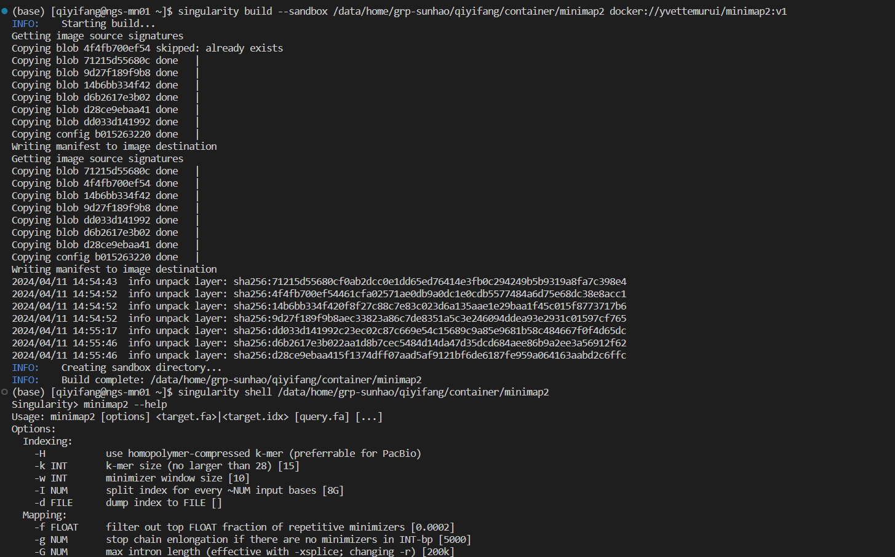

# Docker Hub File

`minimap2` image is stored at: [yvettemurui/minimap2:v1](https://hub.docker.com/layers/yvettemurui/minimap2/v1/images/sha256:f56e28d4011d7d213a8641a05a73e4ea84f698858c0d0fe13b75f500558b8a4b?uuid=42F08370-F3BB-4C6E-96EA-2E2E130AE400)

You can use the command line below to pull this image and build a container in your cluster:

```bash
singularity build --sandbox /path/to/your/container docker://yvettemurui/minimap2:v1
```

And then you can use the `shell` option in `singularity` to run the container interactively:

```bash
singularity shell /path/to/your/container
```

Here is an example:

